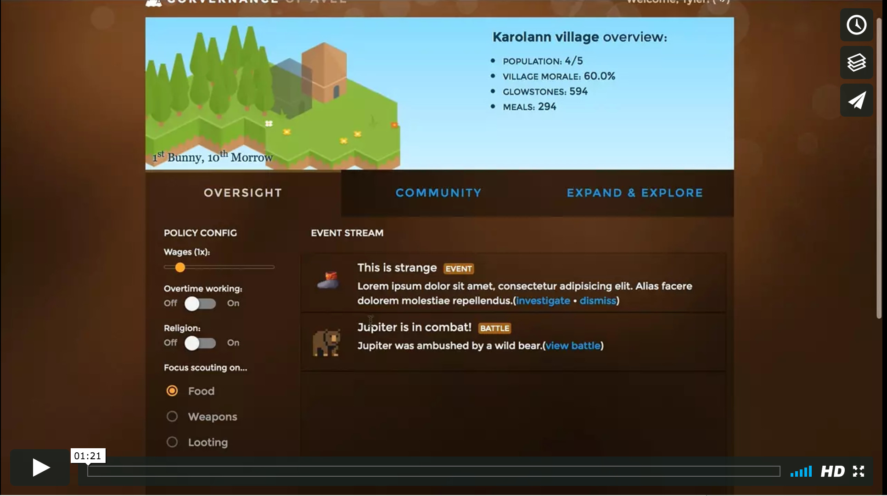

# Government

Government was a real-time strategy game I designed to experiment with React.js/Firebase mid 2015. Most of the code is written in Coffeescript.

The front end sets up variables on a Firebase backend and a [node.js server](https://github.com/tylerdiaz/Government/blob/master/server/server.js.coffee) runs through the configuratinos every second and performs the actions. (resource usage, map exploration, building construction, unit healing, battle turns, ...)

